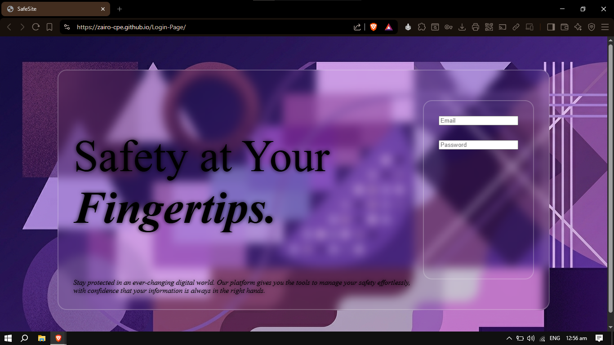

# 🔐 Login Page

A clean and responsive **Login Page** built with vanilla HTML, CSS, and JavaScript — no frameworks, no dependencies, just the fundamentals.

##Open Here:
https://zairo-cpe.github.io/Login-Page/

---

## 📸 Preview



---

## 🚀 Features

- Simple and intuitive login form UI
- Client-side form validation with JavaScript
- Responsive layout that works on mobile and desktop
- Styled with pure CSS (no libraries or preprocessors)
- Lightweight and fast — zero dependencies

---

## 🛠️ Built With

| Technology | Purpose |
|---|---|
| HTML5 | Page structure and form markup |
| CSS3 | Styling, layout, and responsiveness |
| JavaScript (ES6) | Form validation and interactivity |

---

## 📁 Project Structure

```
login-page/
├── index.html       # Main HTML file
├── style.css        # Stylesheet
└── script.js        # JavaScript logic
```

---

## ⚙️ How to Use

1. **Clone the repository**
   ```bash
   git clone https://github.com/your-username/your-repo-name.git
   ```

2. **Navigate into the project folder**
   ```bash
   cd your-repo-name
   ```

3. **Open `index.html` in your browser**
   ```bash
   open index.html
   # or just double-click the file
   ```

No build step or server required — it runs directly in the browser.

---

## ✅ Form Validation

The JavaScript handles the following validations:

- Email field must not be empty and must follow a valid format
- Password field must not be empty
- Error messages are displayed inline when validation fails

---

## 📌 Notes

- This is a **frontend-only** project. There is no backend or real authentication logic.
- Credentials are not stored or processed — this is intended as a UI/UX demo or starting template.
- To connect it to a real backend, you can hook the form's submit event to an API call (e.g., `fetch` or `axios`).

---

## 🤝 Contributing

Pull requests are welcome! If you'd like to improve the design, add features, or fix bugs:

1. Fork the repo
2. Create a new branch (`git checkout -b feature/your-feature`)
3. Commit your changes (`git commit -m 'Add your feature'`)
4. Push to the branch (`git push origin feature/your-feature`)
5. Open a Pull Request

---

## 📄 License

This project is open source and available under the [MIT License](LICENSE).

---

*Made with 💻 using just the basics — HTML, CSS & JS.*
